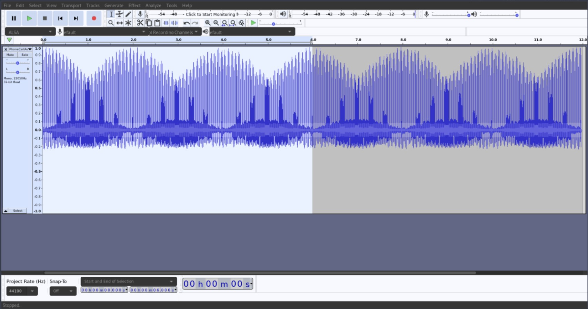
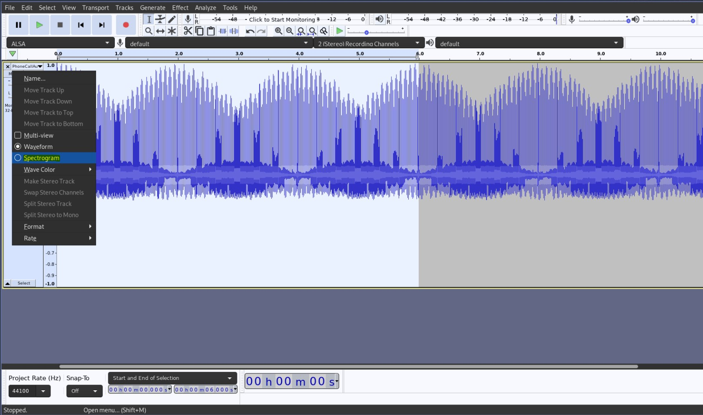
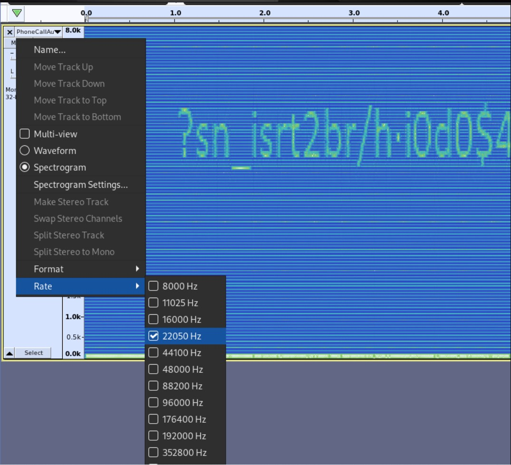
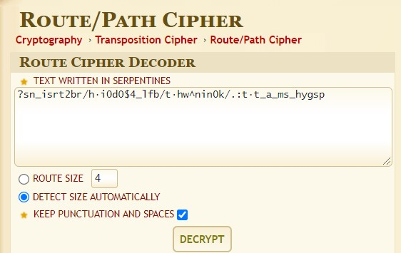
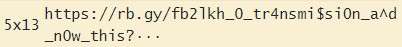
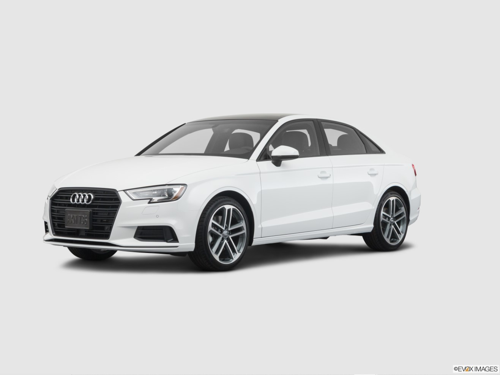

# Car Dealership Phone Call

Website: [FreedomCTF](https://freedomctf.org/)

---

## Category: Forensics/Steganography

## Rank: Legendary

## Hint: When submitting the flag, exclude the "···" after the "?"

## Question: I was en route to pick up my new car from the dealership when suddenly, my phone began playing this sound, do you know what it is saying? Note: the first letter in the flag is lowercase.Find the audio in the discord, "transmission" voice channel.

[File](https://youtu.be/kz_F24WRS0o)

---

## Discord Bot
### When you join the transmission channel in the discord, you hear a single pitch playing. So, you recrod the audio the bot is playing (for example purposes, I used "Audacity").

### Then go to the drop down on the left side and click "Spectrogram" tab.

### To make the graph more clean, you can change the rate to "22050 Hz." As you zoom into the Audio Spectrum and you will see that there is an "?sn_isrt2br/h...". If you are able to read the entire string (or if you dm @ㄥ卂ᎶᎶ丂ㄒ卂尺#4897 a screenshot of this), you find out that the string is, "?sn_isrt2br/h·i0d0$4_lfb/t·hw^nin0k/.:t·t_a_ms_hygsp".

### Then looking back at the question you are able to tell that it is a route cipher because it says, "I was in route." So knowing this, you can use brute force the cipher.

### The only brute foce that has https:// is 5x13:

### Now that you are left with, "https://rb.gy/fb2lkh_0_tr4nsmi$si0n_a^d_n0w_this?", you should go to the website, "https://rb.gy/fb2lkh"; when you open it up, a picture of an Audi is shown.

### Lastly, replace the "https://rb.gy/fb2lkh" with Audi and the final flag is flag{audi_0_tr4nsmi$si0n_a^d_n0w_this?}.