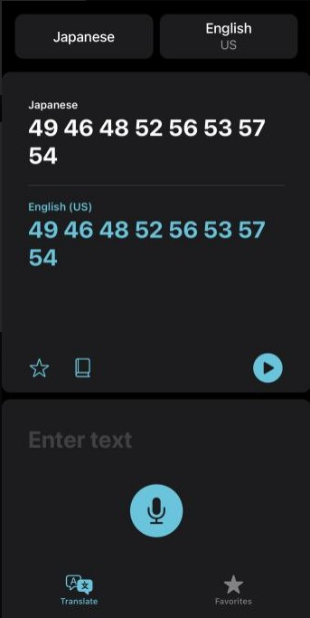
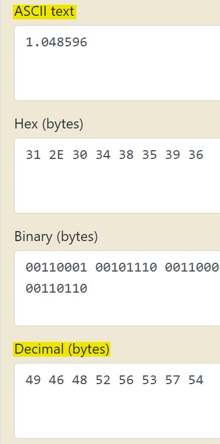
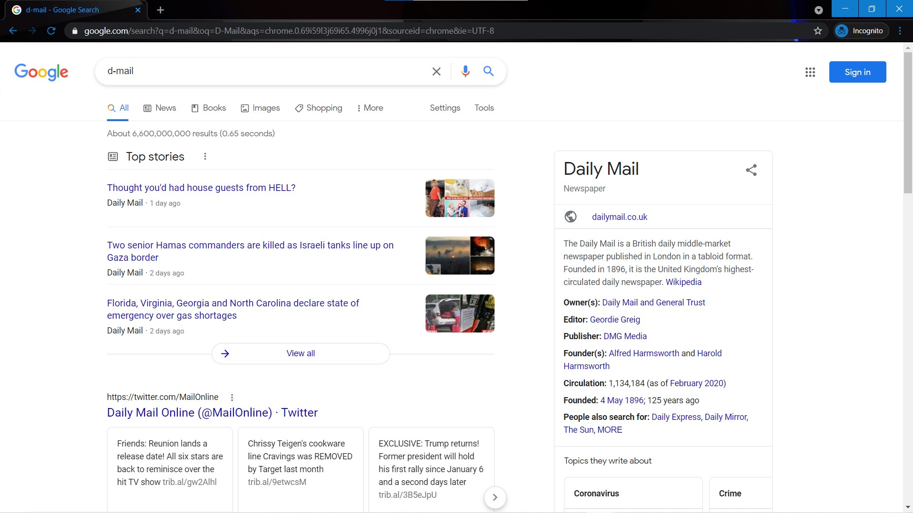
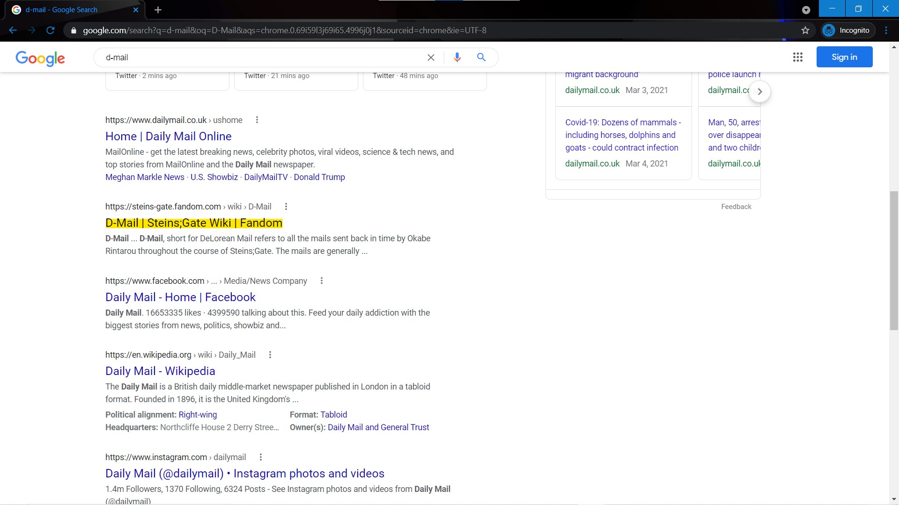
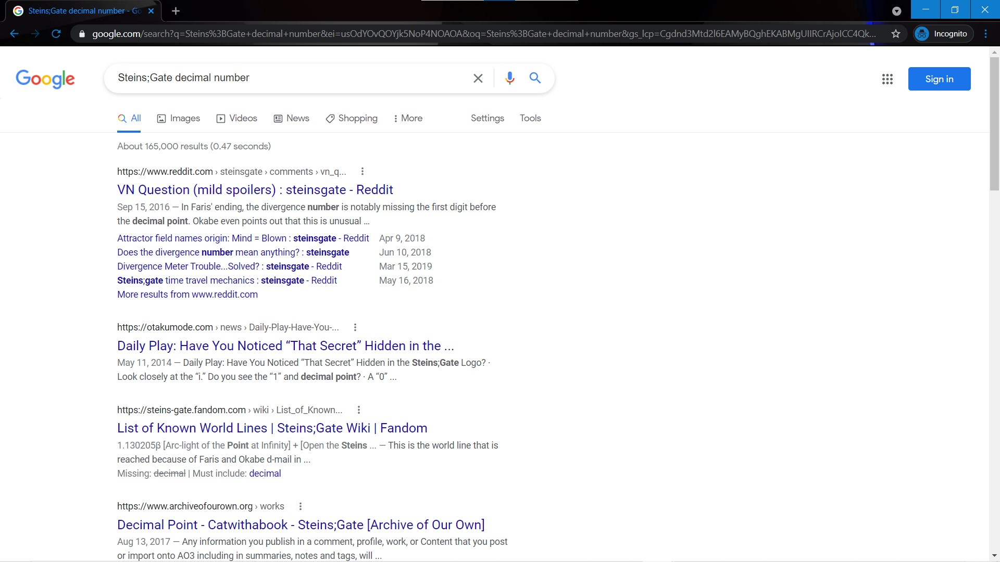
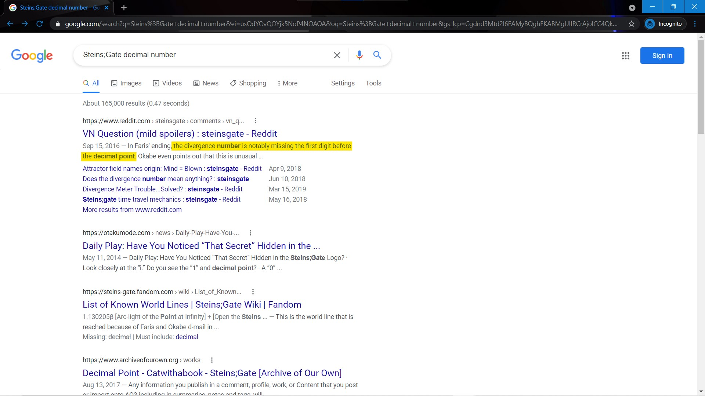
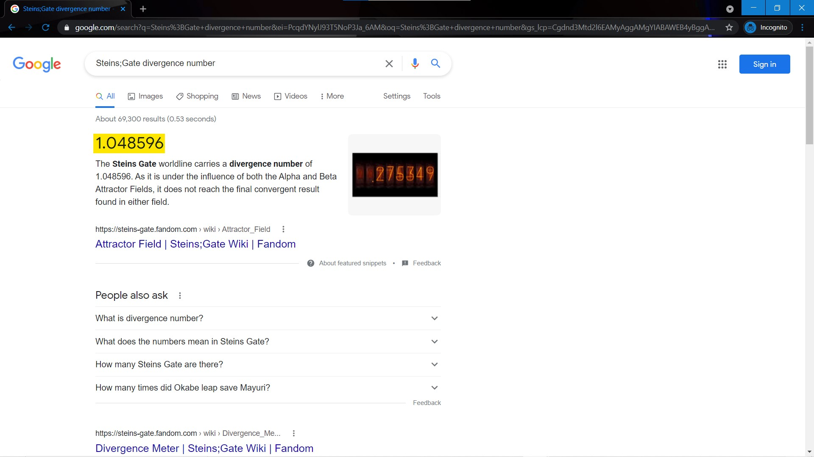

# D-Mail

Website: [FreedomCTF](https://freedomctf.org/)

---

## Category: Miscellaneous

## Rank: Rare

## Hint: None

## Question: Oh no, it looks like someone else found out how to make a D-Mail, but they were able to send an MP3 file! Quick, what is the decimal number at!

[File](https://youtu.be/yhBY6EwSxnM)

---

## Website

## Option 1:

### Playing the audio, you can see that it is not in english, so you can use a translation app and use the microphone feature to have it translate the audio. Once you translate it, you get this:

### Looking back at the question, you see it says decimal number, so you convert from decimal byte to acsii text.

### So your flag is flag{1.048596}.

---

## Option 2

### Searching up "D-Mail" on Google, you get see a website named that has [D-Mail | Steins;Gate Wiki | Fandom](https://steins-gate.fandom.com). From this, you know the name of the show.

### From this you can tell the name of the show, and you should now search "Steins;Gate decimal number".

### Once you search this up, you see "the divergence number."

### Then, you search "Steins;Gate divergence number" to get "1.048596"

### Lastly, put this number in flag format to get, flag{1.048596}.