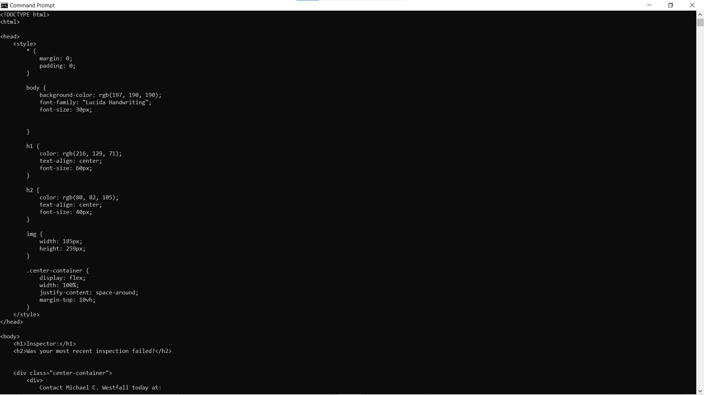
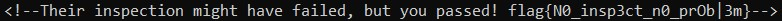

# Failed Inspection

Website: [Failed Inspection](https://failedinspection.freedomctf.org/)

---

## Category: Web Exploitation

## Rank: Rare

## Hint: None

## Question: "Hey, why isn't it letting me copy the email address?"

---

## Website

### When you try to access the website, the tab is immediately closed (and if you manage to bypass that and try to open inspect element, it will not work), thus you should use other resources (for this example, I used "curl").

### First open "Command Prompt" and typed in "curl https://failedinspection.freedomctf.org/" to get the HTML.

### Then when you scroll down, you see a comment in HTML that says "<!--Their inspection might have failed, but you passed! flag{N0_insp3ct_n0_prOb|3m}-->."

