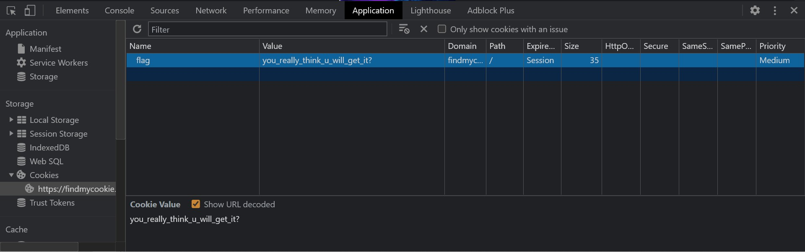
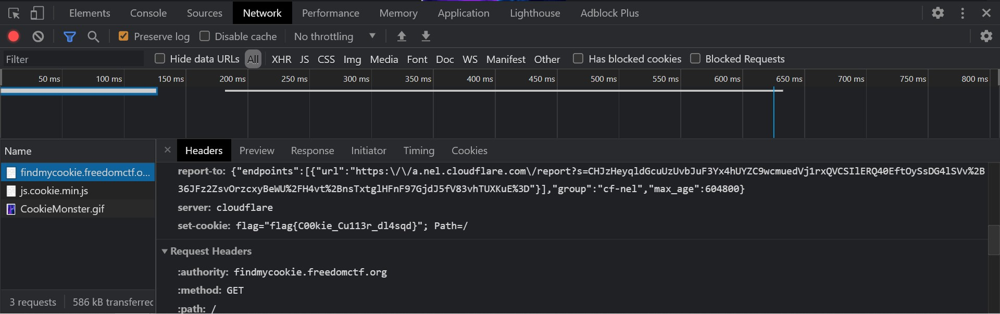

# Find My Cookie

Website: [Find My Cookie](https://findmycookie.freedomctf.org/)

---

## Category: Web Exploitation

## Rank: Rare

## Hint: Hit ya with da 1 2 fakearoo ;)

## Question: Cookie Monster wants his cookie but can't seem to find it. Can you help them find it?

---

## Website

### When you go to the "Application" tab in Inspect Element, you see there is a cookie in the Application section. However, if you try to submit that, it will be incorrect.

### So one way you can solve this is by going to the "Network" tab and see what is being passed through in "https://findmycookie.freedomctf.org/". As you scroll down in the "Headers" tab, you will see there is a "set-cookie" header response which contains the flag, "flag{C00kie_Cu113r_dl4sqd}."

