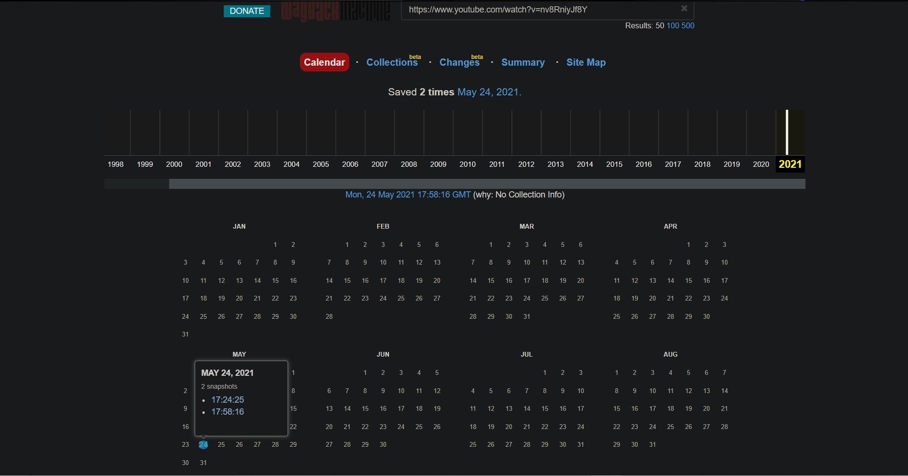
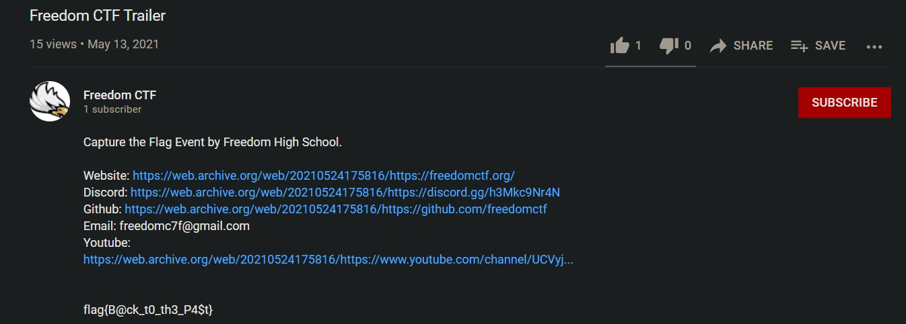

# Freedom CTF Trailer

Website: [FreedomCTF](https://freedomctf.org/)

---

## Category: Social Engineering

## Rank: Common

## Hint: None

## Question: I'm getting reports that someone hacked into the channel and changed something, but nothing was different when I logged on and checked. Can you find out what the user changed? You can find the link to the trailer in the discord "announcements" channel.

---

## Website

### When you open the [youtube video](https://www.youtube.com/watch?v=nv8RniyJf8Y), there is everything is normal and there is no flag listed on the page. So in order to see the flag, you should use the [Way Back Machine](https://archive.org/web/), and see the changes made on the page.

### From there, type in the [youtube video url](https://www.youtube.com/watch?v=nv8RniyJf8Y) and choose the latest date (May 24, 2021 at the time 17:58:16).

### Then if you scroll to the caption of the video and expand it, at the bottom is the flag, "flag{B@ck_t0_th3_P4$t}."

