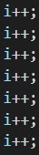

# If Lop Part 2

Website: [FreedomCTF](https://freedomctf.org/)

---

## Category: Reverse Engineering

## Rank: Rare

## Hint: Scribing == true

## Question: I see you have come back for more pain. Why?

---
## Website 

### When you look at the program you fist see two ints and three strings that are instantiated, and as you scroll down, you see that these variables are being changed. So, you want to keep track of what the variables are and when they are "called."

 
 

### The variable's values are changed by the calling ++, --, or maunally setting the value of the variable, but you have to be careful, becuase not everything changes the value of the variable.

### In addition, there are arrys, for loops, arraylists, and other versions of if statements (chain ternary) which might require you to do some research in order to properly follow the code.

 
 

### How to solve this: A simple way to solve this is to write a print statement after each of the if statments and for loops.

 
 

### Below are all of the following things that compile and print to get you the flag, "flag{ad\/4ncea_O|=_if}".

* Flag:
    * Line 136's if statment = "a"
    * Line 143's if statment = "d"
    * Line 255's if statment = "\"
    * Line 293's if statment = "/"
    * Line 304's if statement = "4"
    * Line 309's if statment = "n"
    * Line 314's if statment = "c"
    * Line 348's if statment = "e'
    * Line 436's if statment = "a"
    * Line 529's if statment = "_"
    * Line 558's substring = "O"
    * Line 596's if statement = "|"
    * Line 615's if statement = "='
    * Line 647's if statement = "_"
    * Line 702's if statement = "i"
    * Line 749's if statement = "f"