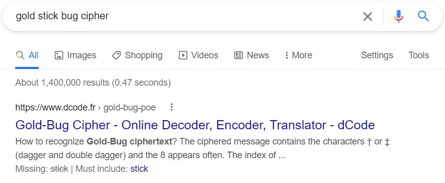
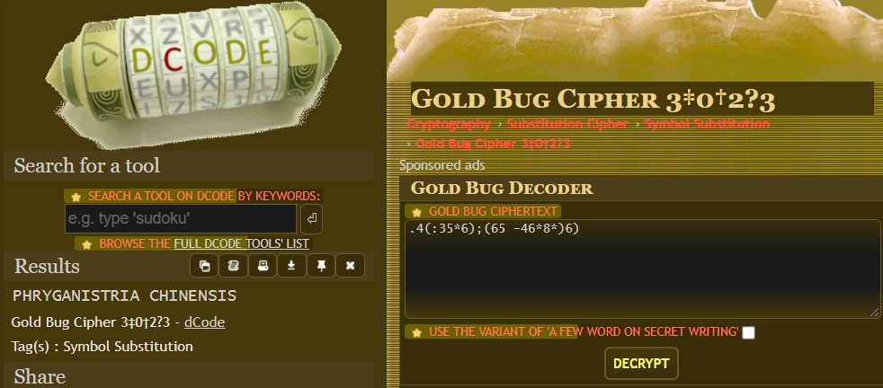

# Stick Bug

Website: [FreedomCTF](https://freedomctf.org/)

---

## Category: Cryptography

## Rank: Rare

## Hint: Gold: https://www.youtube.com/watch?v=9BalEldzE8o

## Question: Deep within the forest lies the ".4(:35*6);(65 -46*8*)6)".

---

## Website

### When you click on the hint, you are redirected to the "Stick Bug" video :), but this has a meaning. If you search up "gold stick bug cipher", you see there is a cipher listed.

### You can then put this in the decrypter and get the flag, "flag{phryganistria chinensis}".

