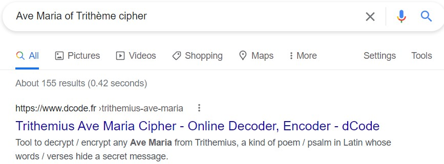

# Toujours

Website: [FreedomCTF](https://freedomctf.org/)

---

## Category: Cryptography

## Rank: Rare

## Hint: Note is the same for the other language included and all lowercase

## Question: Check out this poem I made in class:
    Dans la béatitude pour toujours
    Dans la félicité en une infinité
    Dans la gloire irrévocablement
    éternellement à perpétuité
    Dans la divinité pour toujours
    à perpétuité dans la lumière

---

## Website

### If you search up the poem in google, you will get results showing, "Les Ave Maria de Trithème", or in English, "The Ave Maria of Trithème."

### Knowing this, you can search, "Ave Maria of Trithème cipher."

### Then, put the poem in the decrypter and notice how it says, "NB: The Latin alphabet does not differentiate letter 'U' and 'V' or 'W' and also 'I' and 'J'.", so looking at the decryption, "UORDLIKEPOEM", you can replace the "U" with a "w" to get the flag, "flag{wordlikepoem}."
